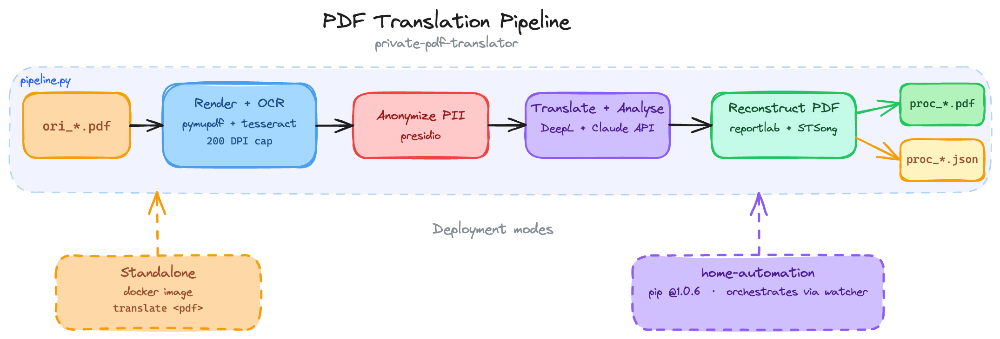

# German Mail Pipeline

Processes scanned German mail (PDF or photo) into a structured output PDF. Uses Tesseract OCR,
Presidio PII redaction, DeepL for translation, and Claude AI (`claude-sonnet-4-6`) for analysis.

## Architecture

The pipeline runs as a single `translate` entrypoint that starts a Dockerized Python workflow. It first OCRs the document page by page, then conditionally redacts and translates the extracted text before sending only redacted content to Claude for structured analysis. The final step assembles a PDF that combines the summary, translation, and original OCR output, and writes a sidecar JSON file for downstream automation.

This repository is the document-processing engine only. File watching, orchestration, D1/R2 upload, and Telegram notification live in [home-automation](https://github.com/YimengL/home-automation), which installs and calls this repo as a standalone processor.

The diagram below shows the end-to-end processing flow from input file to generated PDF and metadata:




## Prerequisites

- Docker Desktop (running)
- Secrets via Doppler, env var, or Mac Keychain (see below)

## Install

```bash
# Clone the repo
git clone git@github.com:YimengL/private-pdf-translator.git ~/git/private-pdf-translator

# Install the translate command (one-time)
ln -s ~/git/private-pdf-translator/translate.sh /usr/local/bin/translate
```

The Docker image is built automatically on first run.

## Secrets

Resolution order: env var → Doppler → Mac Keychain.

```bash
# Mac Keychain (fallback)
security add-generic-password -a "$USER" -s "anthropic-german-mail" -w "sk-ant-xxxxx"
security add-generic-password -a "$USER" -s "deepl-german-mail" -w "your-deepl-key"

# Doppler (recommended)
doppler setup  # select project: private-pdf-translator, config: prd
```

## Usage

### Standalone processor

```bash
translate ~/gdrive/mail_in/ori_letter.pdf
```

This repo exposes a single `translate` command:

- Input: PDF or image file (`.pdf`, `.jpg`, `.jpeg`, `.png`, `.tiff`)
- Input filename: any file not prefixed `proc_` (`ori_` is stripped if present)
- Output: `proc_*.pdf` in the same folder
- Sidecar metadata: `proc_*.json` alongside the output PDF

### Automated workflow

If you want a watched inbox and downstream automation, use [home-automation](https://github.com/YimengL/home-automation). That repo is responsible for:

- watching the input folder
- invoking `translate`
- uploading results to D1/R2
- sending Telegram notifications

## Output

**German input:**
```
Page 1      Summary — importance score, type, sender, deadline, action points,
                      key info (EN + 中文), sensitive info
Page 2–x    DeepL translation
Page x–y    OCR German (for verification)
```

**English input (auto-detected):**
```
Page 1      Summary — importance score, type, sender, deadline, action points,
                      key info (EN + 中文), sensitive info
```

PII redacted before any text reaches Claude:
- German input: phone numbers, IBAN, tax ID, passwords
- English input: phone numbers, IBAN

## Sidecar JSON

Every processed file produces a `proc_filename.json` alongside the PDF. This is the contract for downstream automation (DB write, R2 upload, Telegram notification).

Fields: `schema_version`, `filename`, `original_filename`, `date`, `issued`*, `sender`, `reference`*, `type`, `importance`, `amount`*, `deadline`*, `action_items`, `ocr_confidence`, `deepl_score`*, `claude_confidence`, `tokens_in`, `tokens_out`, `cost_usd`, `model`

*optional — omitted if not found or uncertain

## Known limitations

- CJK mixed lines (Chinese + German) fall back to Helvetica — German umlauts normalised (ß→ss etc.)
- English input (auto-detected via langdetect) — pipeline logic implemented but untested on real English mail
- Image input (.jpg, .png etc.) — code path exists but untested
