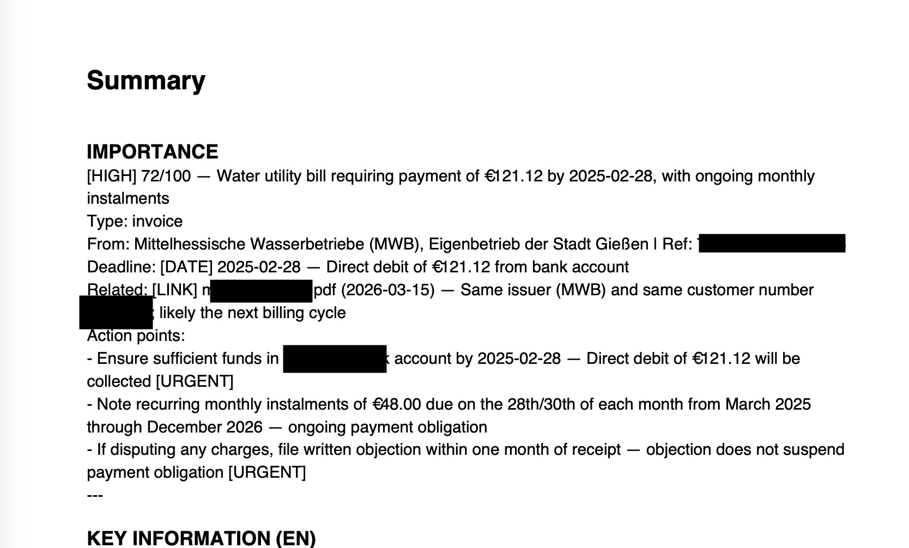

# German Mail Pipeline

Processes scanned German mail (PDF or photo) into a structured output PDF. Uses Tesseract OCR,
Presidio PII redaction, DeepL free API for translation, and
Claude AI (claude-sonnet-4-6) to analyse the redacted content.



## Prerequisites

- Docker Desktop (running)
- Mac Keychain entries:

```bash
security add-generic-password -a "$USER" -s "anthropic-german-mail" -w "sk-ant-xxxxx"
security add-generic-password -a "$USER" -s "deepl-german-mail" -w "your-deepl-key"
```

## Install

```bash
# Clone the repo
git clone git@github.com:yourname/private-pdf-translator.git ~/git/private-pdf-translator

# Install the translate command
cp translate.sh /usr/local/bin/translate
chmod +x /usr/local/bin/translate

# The image is built automatically on first run of `translate`
```

## Usage

```bash
translate ~/mails/2024_001/ori_2024_001_letter.pdf
```

Any file not prefixed `proc_` is treated as input. Output is prefixed `proc_`, saved in the same folder. The `ori_` prefix is stripped if present.
Also accepts image files: `.jpg`, `.jpeg`, `.png`, `.tiff`

## Output

**German input:**
```
Page 1        Summary — importance score, type, sender, deadline, action points,
                        key info (EN + 中文), sensitive info
Page 2–x      Claude full translation
Page x–y      DeepL translation
Page y–z      OCR German (for verification)
```

**English input (auto-detected):**
```
Page 1        Summary — importance score, type, sender, deadline, action points,
                        key info (EN + 中文), sensitive info
Page 2–x      Claude analysis
```

PII redacted before any text reaches Claude:
- German input: phone numbers, IBAN, tax ID, passwords
- English input: phone numbers, IBAN

## Known limitations

- CJK mixed lines (Chinese + German) fall back to Helvetica — German umlauts normalised (ß→ss etc.)
- English input (auto-detected via langdetect) — pipeline logic implemented but untested on real English mail
- Image input (.jpg, .png etc.) — code path exists but untested

## Sidecar JSON

Every processed file produces a `proc_filename.json` alongside the PDF. This is the contract for downstream automation (DB write, R2 upload, Telegram notification).

Fields: `schema_version`, `filename`, `original_filename`, `date`, `issued`*, `sender`, `reference`*, `type`, `importance`, `amount`*, `deadline`*, `action_items`, `ocr_confidence`, `deepl_score`*, `claude_confidence`, `tokens_in`, `tokens_out`, `cost_usd`, `model`

*optional — omitted if not found or uncertain

